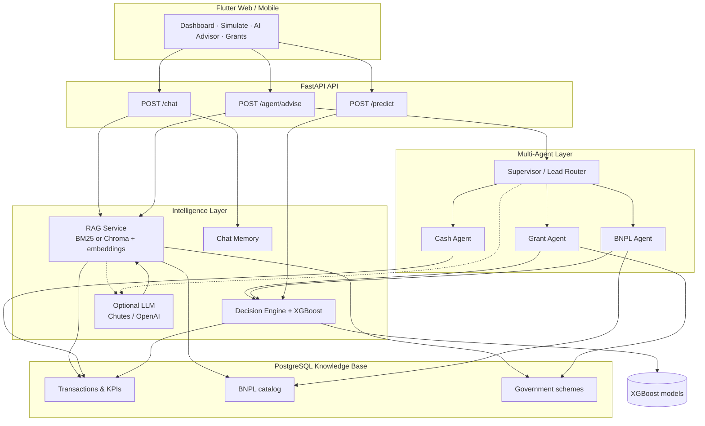

# BNPL Advisor for SMEs — Pitch Deck (AIC2026)

Use this document to build your deck in **Canva**, **Google Slides**, or **PowerPoint**, then upload to Google Drive / OneDrive with **“Anyone with the link can view.”**

**Rules recap:** Max **10 content slides** (title + thank-you slides do **not** count). You **must** include an **Agent Framework Diagram** on one slide (Slide 5 below).

**Live demo:** https://mizn08.github.io/SME-LLM/  
**Repo:** https://github.com/mizn08/SME-LLM

---

## Slide 0 — Title (does not count)

**BNPL Advisor for SMEs (Malaysia)**  
*AI-powered financing decisions: BNPL · micro-credit · government grants*

Team name · AIC2026 · [your email]

Optional footer: Demo → mizn08.github.io/SME-LLM

---

## Slide 1 — The problem

**Malaysian SMEs struggle to choose the right way to pay for growth**

- **Too many options:** BNPL (Atome, Grab PayLater, etc.), micro-credit, CGGS / MDEC-style grants — each with different fees, caps, and eligibility.
- **Cash is fragile:** Many SMEs have **&lt; 45 days cash runway** but still face urgent purchases (inventory, equipment, digital tools).
- **Advice is fragmented:** Banks, BNPL apps, and grant portals do not compare options on **your** transaction history in one place.
- **Result:** Expensive BNPL when cash was fine, missed grants, or credit that hurts liquidity.

*One stat to cite (optional):* Malaysia has 1M+ SMEs; working-capital gaps are a top reason for stalled growth (BNM / SME Corp reports — verify latest figure for your script).

---

## Slide 2 — Our solution

**SME Advisor — one app, grounded recommendations**

A **Flutter web/mobile** front end + **FastAPI** backend that:

1. Ingests SME **bank/CSV transactions** → health KPIs (runway, burn, category spend).
2. **Simulates** a purchase → recommends **BNPL vs micro-credit vs grant vs pay cash**.
3. **AI Advisor** — RAG chat + **multi-agent** specialists (Grant, BNPL, Cash) with optional **Chutes / OpenAI** LLM.
4. **Grants & marketplace** — Malaysian schemes and BNPL catalog in one knowledge base.

**Tagline:** *“Don’t guess your financing — simulate it on your own books.”*

---

## Slide 3 — Who we serve

| Segment | Pain | How we help |
|---------|------|-------------|
| **Micro SMEs** (kopitiam, agro, digital services) | Thin cash buffer | Preserve runway; nudges + BNPL vs cash |
| **Growth SMEs** | Equipment / inventory spikes | Compare total cost; grant eligibility |
| **Judges / partners** | Need proof without APK | **Web demo** — no install |

**Geography:** Malaysia-first (SST, Islamic financing filter, local BNPL & gov schemes in DB).

---

## Slide 4 — How it works (user journey)

```
Upload CSV / sample data → Dashboard (KPIs)
        ↓
Simulate purchase (amount + category + BNPL plan)
        ↓
POST /predict → ML + rules → recommendation + factors
        ↓
AI Advisor: RAG chat OR multi-agent advise OR guided 5-step wizard
        ↓
Grants · pitch PDF · lead score · nudges (APC features)
```

**30-second demo script**

1. Open https://mizn08.github.io/SME-LLM/
2. Menu → **Upload** → **Try sample data**
3. **Health** → show runway / spend
4. **Simulate** → change amount → show different BNPL/cash result
5. **AI Advisor** → Agents tab → show Grant / BNPL / Cash insights

---

## Slide 5 — Agent framework diagram (REQUIRED)

**Put this diagram on its own slide.** Redraw in Canva using boxes/arrows, or export the Mermaid diagram below as PNG ([mermaid.live](https://mermaid.live)).

### Mermaid (copy to mermaid.live → Export PNG → insert in deck)



### Plain-text version (if you draw manually in Canva)

```
┌─────────────────────────────────────────────────────────────┐
│  Flutter UI: Health · Simulate · AI Advisor · Grants        │
└───────────────────────────┬─────────────────────────────────┘
                            │
        ┌───────────────────┼───────────────────┐
        ▼                   ▼                   ▼
   POST /chat        POST /agent/advise    POST /predict
        │                   │                   │
        ▼                   ▼                   ▼
   RAG + memory      Supervisor ──► Grant / BNPL / Cash agents
   (BM25/Chroma)            │              │
        │                   └──────► Decision engine + XGBoost
        ▼                              │
   PostgreSQL ◄── transactions, BNPL catalog, gov schemes
        │
        └──► Optional LLM (Chutes) — answers grounded in retrieved docs only
```

**Caption for slide:** *Specialist agents analyze the same scenario; RAG grounds answers in SME data; decision engine produces auditable BNPL/grant/cash picks.*

---

## Slide 6 — Technology stack

| Layer | Stack |
|-------|--------|
| **Frontend** | Flutter 3.24 (web + mobile), Provider, fl_chart |
| **API** | FastAPI, Uvicorn, SQLAlchemy |
| **Database** | PostgreSQL (Render) / SQLite (local) |
| **ML** | scikit-learn, XGBoost, SHAP-style factors |
| **AI** | BM25 RAG (`rank-bm25`), optional Chroma; LangChain multi-agent + tools; Chutes API |
| **Deploy** | GitHub Pages (web) + Render (API + DB) |

**Design choice:** LLM is **optional** — core value works offline with rules + ML + BM25 (important for demos if API cold-starts).

---

## Slide 7 — Why we’re different

| Others | SME Advisor |
|--------|-------------|
| Single product (BNPL-only or bank-only) | **Compare** BNPL, credit, grants, cash on same purchase |
| Generic chatbots | **RAG** over *your* transactions + MY schemes |
| Black-box scores | **Explainable** factors on `/predict` |
| One-size advice | **Multi-agent** debate: Grant vs BNPL vs Cash preservation |
| App install friction | **One-link web demo** for judges |

---

## Slide 8 — Traction & validation

**Built & deployed (not mockups only)**

- ✅ End-to-end prototype live: https://mizn08.github.io/SME-LLM/
- ✅ API + Swagger: https://sme-advisor-api-pp6d.onrender.com/docs
- ✅ Seeded Malaysian SMEs, 6 months transactions, BNPL offers, gov schemes
- ✅ Multi-agent + RAG + ML simulator in production code path
- ✅ GitHub Actions → auto-deploy web on push to `main`

**What to show live (backup if cold start):** Swagger `/health`, screenshot of Simulate result changing with amount.

---

## Slide 9 — Impact & business model (optional framing)

**Impact**

- Help SMEs **preserve cash** and **access grants** they already qualify for.
- Reduce over-reliance on high-fee BNPL for small purchases when runway allows cash.

**Monetization paths (future)**

- B2B: white-label for banks / BNPL providers / MDEC partners.
- Referral / API fees on qualified grant or credit applications.
- Premium: OCR invoices, open banking, lender marketplace.

*Keep this slide honest — prototype stage for APC.*

---

## Slide 10 — Roadmap & team ask

**Next 6 months**

1. Open banking ingestion (real accounts vs CSV).
2. Stronger grant application workflow + status tracking.
3. Fine-tuned SME LLM on anonymized advisory traces.
4. Pilot with 10–20 real SMEs in Klang Valley.

**Ask**

- Feedback on agent architecture and grant coverage.
- Introductions to SME Corp / fintech partners for pilot.

**Contact:** [your name, email, GitHub]

---

## Slide 11 — Thank you (does not count)

**Thank you**

**Try the demo:** https://mizn08.github.io/SME-LLM/  
**Code:** https://github.com/mizn08/SME-LLM

Questions?

---

## Submission checklist

- [ ] **≤ 10 content slides** (slides 1–10 above; title + thank-you extra)
- [ ] **Agent Framework Diagram** embedded on Slide 5 (not only in speaker notes)
- [ ] Upload to Google Drive / OneDrive / Canva / Notion
- [ ] Sharing: **Anyone with the link can view** (not “restricted”)
- [ ] Paste link in **Pitch Deck URL** field
- [ ] Rehearse 3–5 min pitch + 2 min live demo

---

## 3-minute spoken script (outline)

| Time | Content |
|------|---------|
| 0:00–0:30 | Problem: SMEs choose wrong financing; cash runway risk |
| 0:30–1:00 | Solution: one advisor — simulate + AI + grants |
| 1:00–1:45 | **Agent diagram:** Flutter → 3 API paths → Grant/BNPL/Cash agents → RAG + DB → optional LLM |
| 1:45–2:30 | **Live demo:** sample data → simulate → AI agents |
| 2:30–3:00 | Deployed URLs, roadmap, thank you |

---

## Quick Canva build tips

1. Template: “Startup pitch deck” or “Tech presentation” (10 slides).
2. Brand colors: match app — primary `#2563EB`, background `#FAFAFA`, borders `#E5E7EB`.
3. Slide 5: use **Diagram** shapes or import PNG from mermaid.live.
4. Add QR code (optional) pointing to https://mizn08.github.io/SME-LLM/
